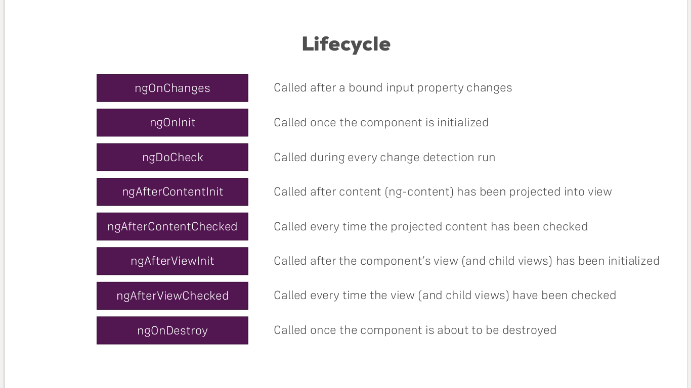

<h1>Udemy - Angular 8 - The Complete Guide</h1>
<h2> Course Structure</h2>

- Getting Started
- The Basics
- Components & Databinding
- Directives
- Services & Dependency Injection
- Routing
- Observable
- Forms
- Pipes
- Http
- Authentication
- Optimizations & NgModules
- Deployment
- Animations & Testing

<h2>Components & Databinding Deep Dive </h2>
<h3> Binding custom properties </h3>

- use @Input('alias name') from '@angular/core' to binding child component

<h3> Binding custom event </h3>

- use @Output('alias name) from '@angular/core' to binding parent component
- use EventEmitter from '@angular/core'

<h3>View Encapsulation</h3>
<h4>Member<h4>

- Emulated
- Native
- None
- ShadowDom
> link: [view encapsulation](https://angular.io/api/core/ViewEncapsulation)

<h3>Using Local References in Templates </h3>

- use #name in html
> link: [Local References in Angular](http://www.jcombat.com/angular-5/local-references-in-angular)

<h3>Getting Access to the TEmplate & DOM with @ViewChild</h3>

> @ViewChild
> link [Angular @ViewChild](https://blog.angular-university.io/angular-viewchild/)

<h3>Projecting Content into Components with ng-content</h3>

> link: [Angular ng-content and Content Projection](https://blog.angular-university.io/angular-ng-content/)
> link: [What Is Ng-Content?](https://medium.com/@joshblf/wtf-is-ng-content-8382b2a664e1)

<h3>Understanding the Component Life cycle</h3>

