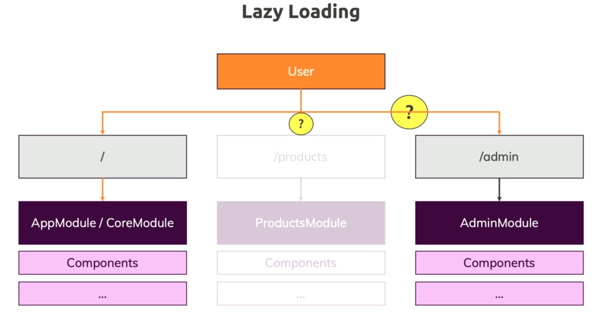

<h1>Udemy - Angular 8 - The Complete Guide</h1>
<h2> Course Structure</h2>

- Getting Started
- The Basics
- Components & Databinding
- Directives
- Services & Dependency Injection
- Routing
- Observable
- Forms
- Pipes
- Http
- Authentication
- Optimizations & NgModules
- Deployment
- Animations & Testing

<h3>Validation to the Form</h3>

> ngForm
> pattern: [regex](https://regexr.com/)

<h3>Useful Resources & Links</h3>

> Firebase Auth REST API Docs: [Auth Rest API](https://firebase.google.com/docs/reference/rest/auth)  
> More on JWT: [JWT](https://jwt.io)

<h3>Understanding the Different Approaches</h3>

> 

<h3>Dynamic component loader</h3>

> [Dynamic component loader](https://angular.io/guide/dynamic-component-loader)

<h3>Modules</h3>

> 

<h3>Feature Modules</h3>

> 

<h3>Shared Modules</h3>

> 

<h3>The Core Modules</h3>

> 

<h3>Lazy Loading</h3>

> 

<h3>Services Modules</h3>

> 

<h3>Ahead-of-Time(AoT) vs Just-inTime(JiT) Compilation</h3>

> 

<h3>NgModules</h3>

> [NgModules](https://angular.io/guide/ngmodules)

<h3>NgModule FAQ</h3>

> [NgModule FAQ](https://angular.io/guide/ngmodule-faq)

<h3>Deployment Preparation</h3>

> 

<h3>Deployment Firebase Hosting</h3>

> Build product: `ng building --prod`  
> Install the Firebase CLI via npm by running the following command:  
> `npm install -g firebase-tools`  
> Login: `firebase login`  
> Init: `firebase init`

<h3>Firebase Hosting</h3>

> [Firebase Hosting](https://firebase.google.com/docs/hosting)

<h3>Server Routing vs Browser Routing</h3>

> [Server Routing vs Browser Routing](https://academind.com/learn/angular/angular-q-a/#how-to-fix-broken-routes-after-deployment)
